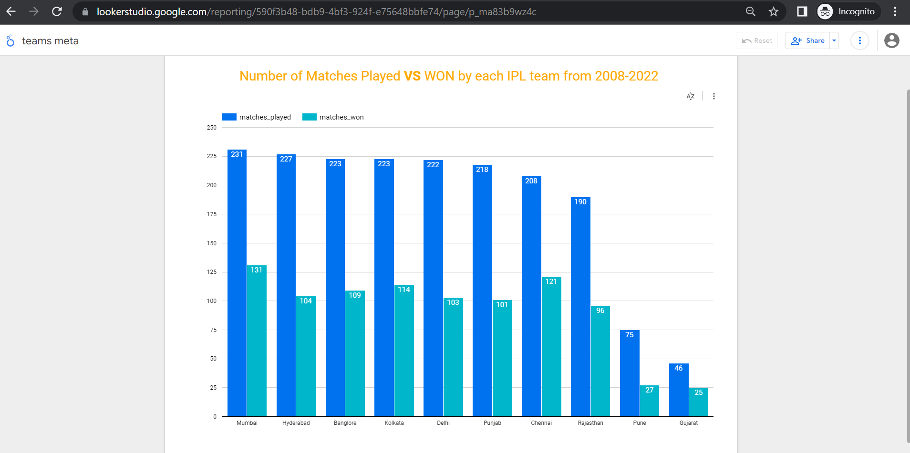

# **jagadish-dezoomcamp-final-project**
This is Final project by Jagadeesh Dachepalli as part of DataTalksClub DE Zoomcamp course

## **Problem description**
This project is all about the **IPL tournament**. IPL also knows as Indian Premiure League is one of the highly rated and popular cricket tournament across the globe. It's hosted by India, however, players from different countries around the world participate in this competitive league. It has completed **15 seasons** till now and the 16th edition (IPl 2023) is just started and going-on.

#### **Objective**
Everytime the fans/viewers want to see the top stats by players/teams, so this is a kind of project to help them view the stats from the data which updates periodically.

This project is to use the IPL dataset for the IPL data from 2008-2022 years, and display some useful information/statistics for the viewers/fans. Although this project is only aimed at brining some visual graphs, this can be even more groomed so that it even helps the players and the team franchises to make some decisions through out the tournament.

* The Dashboards are shared publicly to view, the details are mentioned at the last section of this page.

* The workflow is illustrated [**here**](./flow.jpg)

 

## **Technical Details**
1. **DataLake** : Google Cloud Platform Storage(GCS)
2. **DataWarehouse** : BigQuery 
3. **Workflow Orchestration** : Prefect (runs an ETL job to store the data from external source to the data lake)
    a. Flow scheduler: Prefect
    b. Agent: local/VM machine
    c. job workers: GCP Cloud run job
4. **Transformations** : Pyspark (transforms the data as needed, and store the data into data warehouse)
5. **IaC** : Terraform 
6. **Dashboards** : Google Looker data studio (helps in visually representing the data and also to share with others)

 

### Need to run the below steps in the mentioned order to be able create all the required resources for this project in GCP cloud, to deploy and test this project

 

## **Pre-requisites**
We need to setup the system, incase we're planning to test this project. 
Please refer the file [setup.md](./setup.md) for more details.

 

## **Terraform**
We need to create some infrastructure over a cloud(in this case I'm using Google Cloud), so we're using `terraform` for IaC(Infrastructure as Code) to deploy the resources in an efficient manner.
Please refer the file [terraform.md](./terraform.md) for more details.

 

## **venv setup**
0. Run `sudo apt-get install python3-venv` to install python virtual environment package
1. Create a python virtual enviornment - `python -m venv ipl_venv`
2. Activate the virtual environemnt `source ipl_venv/bin/activate`
3. Install all required python packages in the virtual environment - `pip install -r prefect/requirements.txt`
4. Check the prefect version - `prefect --version`

 

## **Prefect setup and test**
Please refer this [prefect.md file](./prefect.md) for more information.

 

## **Pyspark pipeline**
Please refer this [pyspark.md file](./pyspark.md) for more information.

 

## **Dashboard**
Please remember that this IPL tournament has happened every year from 2008 to 2022 (15 editions so far..).
 
1. **Dashboard - 1** : This is created using the same data we got from the datalake (ofcourse with a little changes over the raw data, these changes are done in the prefect pipeline before storing the data in Datalake)
    1. This has 2 charts -  1st chart(table) shows number of matches played at each venue and the 2nd 
    chart(pie graph) shows percentages of matches won by batting 1st vs batting 2nd vs matches won in an superover result.
    2. URL - https://lookerstudio.google.com/reporting/5109b6af-c929-4dd2-9f27-be979d92761d/page/io1LD
    

 

2. **Dashboard - 2** : This is created using the `team_stats` table which we created and inserted data in the pyspark pipeline using some SQL transformations (union, group by, sort). 
    1. It shows 'total number of matches palyed vs total number of matches won' by each team so far in this tournament (includes all matches form 2008-2022)
    2. URL - https://lookerstudio.google.com/reporting/590f3b48-bdb9-4bf3-924f-e75648bbfe74/page/Sq1LD
    
 

3. **Dashboard - 3** : This is created using the `batting_stats` table/data which we created as part of the same pyspark pipeline using SQL transformations(Join, GroupBy, Sum aggregations, sort). 
    1. This dashboard shows 'total number of runs scored' by each batsman for last 10 years (year-wise)
        1. Also, it has some additional feature i.e., a drop-down to select 1 or multiple batsman
        2. The drop-down shows top 5 run-getters(batsmen).
    2. URL - https://lookerstudio.google.com/reporting/1f70d4c6-ab99-4402-9af5-a2a3bf52c479/page/kl2LD
    
